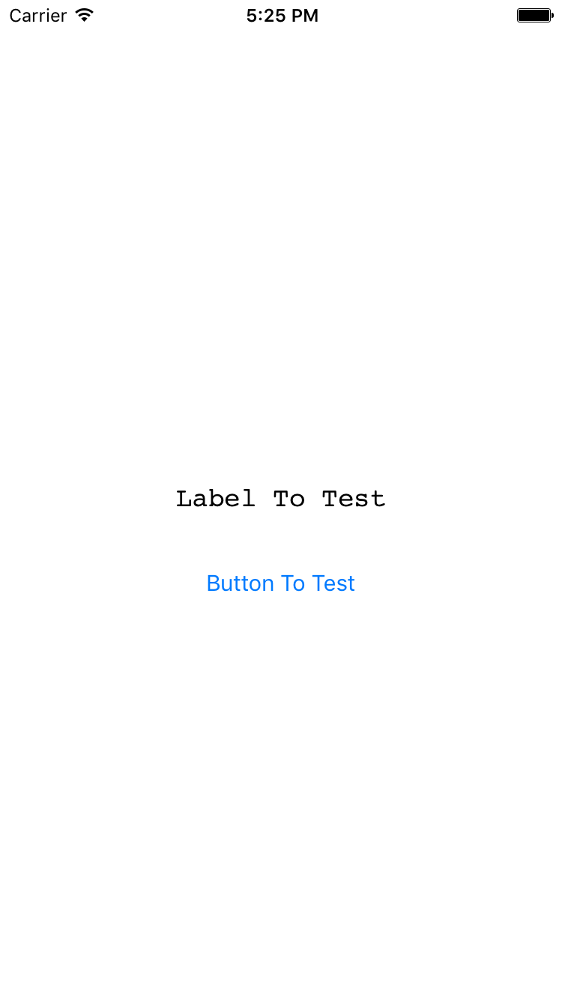

#ZCSwizzle

This is a oc run time wrapper for iOS2.0+, objC 2.0+.

It contains 2 main methods to exchange methods (expecially for system methods);

You can easily do some jobs like try to add a nil into an array or a nil as a key or value in dictionary with commpletely no crash.

But the main use is for system and screen fitting.

If the selector you give is not exist, it will print out an NSError log. So dont worry about the crash, most of the things is considered!

Simply use it:

	+ (BOOL)zc_swizzleMethod:(SEL)origSelector newMethod:(SEL)altSelector error:(NSError**)error;
	+ (BOOL)zc_swizzleClassMethod:(SEL)origSelector newMethod:(SEL)altSelector error:(NSError**)error;

The demo shows a simple application for method swizzling, which font of the Label could randomly changed after every launch.

**However, DONT TRY TO USE THIS FRAMEWORK IN COCOA(OS X)**

IT IS LIGHTWEIGHT FRAMEWORK AND OS X IS NOT SUPPORTED!

I am an iOS developer and OS X is beyond me. Sry guys.

license: MIT 

